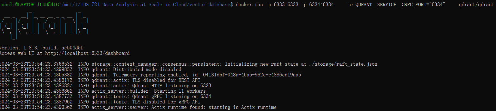
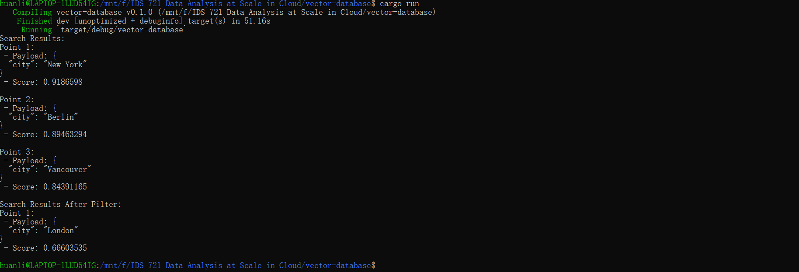
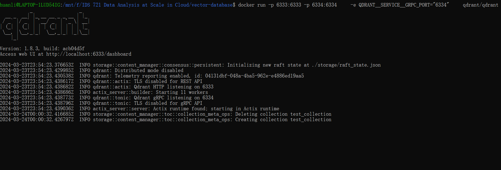

# Data Processing with Vector Database

This project deals with data processing with vector database. The main goal is to ingest data into Vector database, perform queries and aggregations, and visualize the output.

## Project Setup
1. Create a new Rust project.
```bash
cargo new vector-database
```
2. Add the required dependencies to `Cargo.toml` file.
3. For the vector database, I plan to use [Qdrant](https://qdrant.tech/documentation/quick-start/).
- Download the latest Qdrant image from Dockerhub:
```bash
docker pull qdrant/qdrant
```
- Then run the service:
```bash
docker run -p 6333:6333 -p 6334:6334 \
    -e QDRANT__SERVICE__GRPC_PORT="6334" \
    qdrant/qdrant
```

## Data Ingestion
In `main.rs`, I implement the data ingestion and queries according to the official documentation [here](https://qdrant.tech/documentation/quick-start/)

Here is an example of the vector and the payload:
```rust
PointStruct::new(
    1,
    vec![0.05, 0.61, 0.76, 0.74],
    json!({"city": "Berlin"}).try_into().unwrap(),
),
```

## Query Functionality
After ingesting the data, we can test the vector database by running some test queries.

I first ran a query that was executed to search for vectors similar to a given query vector `[0.2, 0.1, 0.9, 0.7]`. It retrieves up to three closest matches to this query vector from the collection. Here is the query code:

```rust
let search_result = client.search_points(&SearchPoints {
        collection_name: collection_name.into(),
        vector: vec![0.2, 0.1, 0.9, 0.7],
        limit: 3,
        with_payload: Some(true.into()),
        ..Default::default()
    }).await?;
```

Then, I ran another query with a simple filter that checks if the previous query result has a city name of "New York". Here is the code snippet:

```rust
let search_result_filtered = client.search_points(&SearchPoints {
        collection_name: collection_name.into(),
        vector: vec![0.2, 0.1, 0.9, 0.7],
        filter: Some(Filter::all([Condition::matches("city", "London".to_string())])),
        limit: 2,
        with_payload: Some(true.into()),
        ..Default::default()
    }).await?;
```

## Visualization




